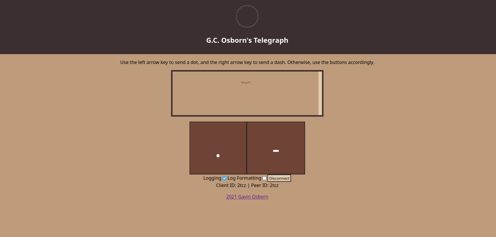

# 2024 Notice

This was a really janky project that I did with the sole purpose of producing something, and at the time Hooks were relatively new. There are some absolute travesties in this project, such as mixing different paradigms for manipulation of state, and of course - direct modification of the DOM. Central organization was hardly of consideration here. Still, an interesting project with some practical use.

# telegraph
A binary-based P2P web-telegraph utilizing React-JS and WebRTC (PeerJS).



## guide
- New Transmission: Open a new room that someone can join.
- Connect by ID: Enter an ID, possibly from the server-browser, to join their room.
- Left Arrow Key: Dot.
- Right Arrow Key: Dash.
- Toggle Log: Enables the log, which displays all transmissions. Useful for learning.
- Toggle Log-Formatting: Enables log formatting, which will attempt to format the log with spaces between letters, slashes between words, and line-breaks between sentences. Time-based, at the moment 0.6 seconds of silence must pass for a space, 1 second for a dash, and 5 seconds for a line-break.

## notes
The sounds are Base64 encoded audio files. I don't know why I did this, it seemed cool at the time and saved me a few bytes. Bizarre sorcery. The downside to this is that they don't play on most mobile browsers.

## deployment
This was initially created with create-react-app, so it's pretty straight forward to deploy. Just create a new react app as you would normally with 'npx create-react-app', then pull some npm magic and run 'npm run build'. Upload the files to a server somewhere and point nginx or what have you there, using the typical index.html. A lets-encrypt cert will do fine for the signalling server. Let it redirect normally. If there are any complaints by the server, add 'add_header Access-Control-Allow-Origin "example.com";' under location / {} within the port 443 server (an nginx example, obviously). This shouldn't be an issue, however.

It's pretty easy to create a bash script to start the signalling server. Within start.sh simply make it executable and add the following line:
```
#!/bin/bash
peerjs --sslkey /path/to/key --sslcert /path/to/cert --port 9000 --allow_discovery true --key peerjs --path /
```
- Remember, [npm install peer -g](https://github.com/peers/peerjs-server)
## future
I plan on replacing the sound-based communication system with a continuous stream at some point. This will allow for a higher WPM for users. I need to clean up the CSS as well. Additionally, log-formatting should be customizable. It may also be nice to have a morse code cheat sheet displayed.
